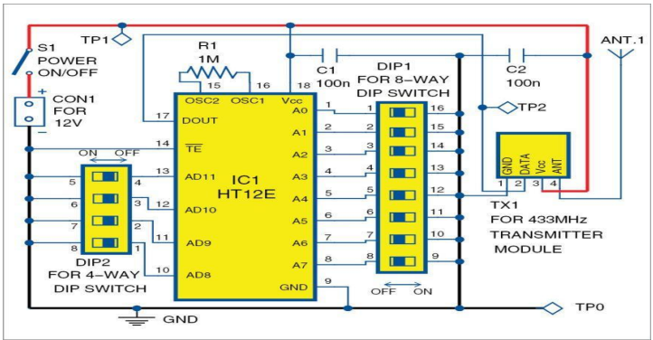
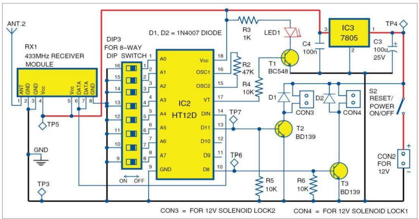

# Smart Knock Door Lock

## Project Description
This project implements a smart door lock system using RF communication and sensors. 
The system allows authorized users to unlock the door wirelessly using encoded RF signals.

## Circuit Diagram

### Transmitter Circuit

### Receiver Circuit

